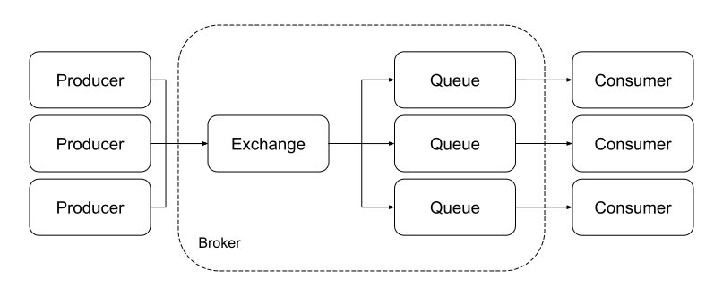

# RabbitMQ

> TL;DR

## Content

**RabbitMQ** is a message broker that implements the **Advanced Message Queing Protocol** (AMQP), which standardizes messaging using producers, a broker, and consumers.

### Message flow

1. A **Producer** publishes a message containing a **routing key** to an Exchange;
2. An **Exchange** has bindings with binding keys to a number of queues and distributes messages based on its type;
3. A **Consumer** polls its queue to retrieve and process messages;

Messages that cannot be routed may be returned to publishers, dropped, or placed in a dead letter queue.

### Exchange types
- **Fanout** ignores the message's routing key and sends it to all queues;
- **Direct** sends message to the queue where `routing key == binding key`;
- **Topic** sends message on a partial match of keys;
- **Header** uses the message header instead of its routing key;
- **Default** (nameless) sends message to queue where `routing key == queue name`;

## References

- [RabbitMQ in 5 Minutes](https://www.youtube.com/watch?v=deG25y_r6OY)
- [AMQP Concepts](https://www.rabbitmq.com/tutorials/amqp-concepts.html)